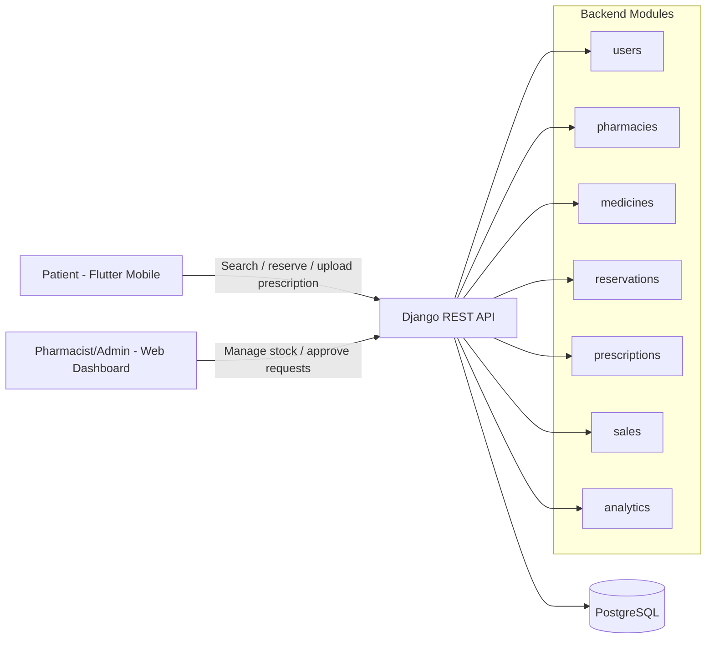
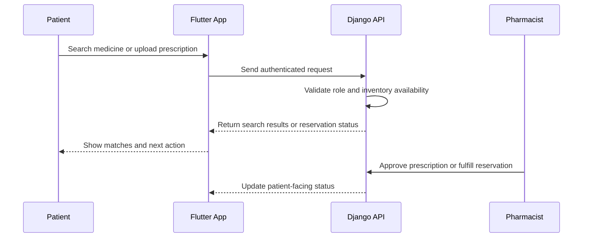

# MedLink: Arba Minch

[](README.md)
[](backend/)
[](pos_app/)
[](backend/)
[](docs/)

**A pharmaceutical ecosystem for fast medicine discovery, reservation, and prescription handling in Arba Minch.**

MedLink connects patients, pharmacists, and admins through a secure Django REST API, a Flutter mobile app, and a web dashboard for pharmacy operations. The goal is simple: reduce medicine search time, make reservations reliable, and keep prescription handling safe.

## Why MedLink Matters

- Patients can search across pharmacies instead of walking from store to store.
- Pharmacists can manage inventory, reservations, and prescription approvals in one place.
- Admins can monitor system activity and sales with a clean role-based flow.
- The product is designed around a realistic workflow with clear operational value.

## System at a Glance



## User Journey Flow



## Core Capabilities

- Medicine inventory search across pharmacies
- Reservation holds with expiry windows
- Prescription upload and approval workflow
- Sales tracking for fulfilled reservations
- Analytics endpoints for daily and weekly summaries

## Tech Stack

- Backend: Django 4.2 + Django REST Framework
- Auth: JWT with role-aware permissions
- Database: PostgreSQL locally or in Supabase
- Mobile: Flutter 3.x
- AI/docs prototypes: Python helpers under `docs/ai/`

## Live API Surface

- Register: `POST /api/auth/register/`
- Token: `POST /api/token/`
- Inventory: `GET /api/inventory/`
- Reservations: `POST /api/reservations/`
- Prescriptions: `POST /api/prescriptions/`
- Analytics: `GET /api/analytics/daily-sales/`

For the full API specification, see [docs/api_design.md](docs/api_design.md).

## Demo Flow

1. Register a patient or use a test account.
2. Search medicine availability.
3. Reserve a medicine item.
4. Upload a prescription if the medicine requires one.
5. Approve or fulfill the request from the pharmacist side.
6. Show the updated reservation and sales trail.

## Project Docs

- [docs/setup_guide.md](docs/setup_guide.md)
- [docs/api_design.md](docs/api_design.md)
- [docs/HANAN_TASKS.md](docs/HANAN_TASKS.md)
- [docs/pitch_deck_outline.md](docs/pitch_deck_outline.md)
- [docs/ai/README.md](docs/ai/README.md)

## Local Run

Backend:

```bash
cd backend
source venv/bin/activate
python manage.py runserver
```

Flutter app:

```bash
cd pos_app
flutter pub get
flutter run
```

## Presentation Notes

- Keep the demo short and visual.
- Show the problem, the search flow, and the role-based action path.
- Use the documentation links above as your support material.