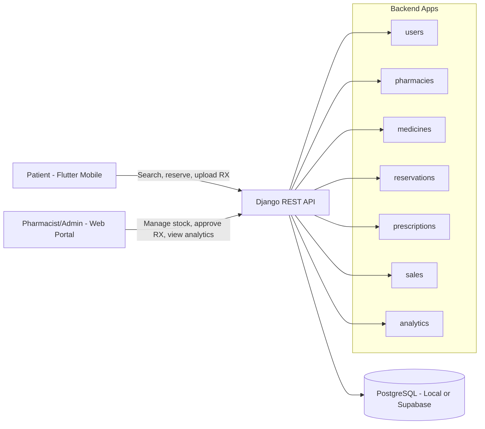

# MedLink: Arba Minch

## Project Overview
MedLink is a pharmaceutical ecosystem built for the Arba Minch community. It helps patients find medicines, reserve stock, and upload prescriptions while giving pharmacists and admins the tools to manage inventory, approvals, and analytics.

## MVP Goals
- Working medicine search and reservation flow for patients
- Clear role separation: patient, pharmacist, admin
- Reliable backend APIs for mobile and web
- Strong documentation for judges and onboarding

## System Architecture

## Repository Structure

### backend/
- medlink/: project settings, urls, wsgi/asgi
- apps/: domain modules (users, pharmacies, medicines, reservations, prescriptions, sales, analytics)
- core/: shared permissions and common logic

### frontend/
- Intended Next.js web portal for pharmacists and admins
- Note: Next.js scaffold is currently missing and should be initialized

### pos_app/
- Flutter app for patient and pharmacy point-of-service workflows

### docs/
- API references, setup guide, architecture, and Hanan task deliverables

## Quick Start
1. Backend setup and run: see [docs/setup_guide.md](docs/setup_guide.md)
2. API reference and test payloads: see [docs/api_design.md](docs/api_design.md)
3. Hanan AI/documentation tasks: see [docs/HANAN_TASKS.md](docs/HANAN_TASKS.md)

## Team Task Guides
- [backend/EYASU_TASKS.md](backend/EYASU_TASKS.md)
- [pos_app/YADESA_TASKS.md](pos_app/YADESA_TASKS.md)
- [frontend/MISIKER_TASKS.md](frontend/MISIKER_TASKS.md)
- [docs/HANAN_TASKS.md](docs/HANAN_TASKS.md)

## Why MedLink
- Localized for real pharmacy discovery in Arba Minch
- JWT-based authentication with role-aware access paths
- Reservation and prescription workflows designed for practical use
- Documentation-first approach for strong hackathon presentation
